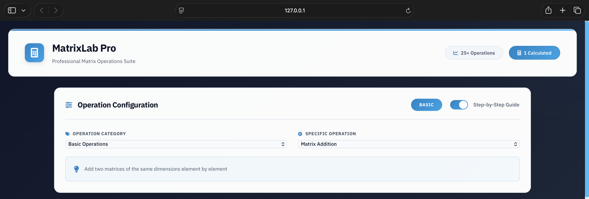
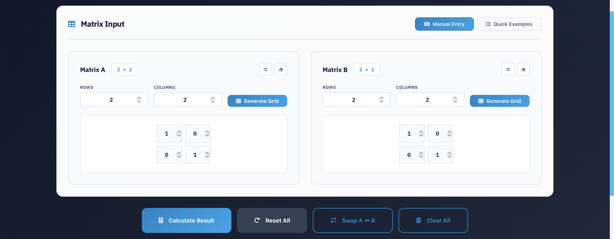
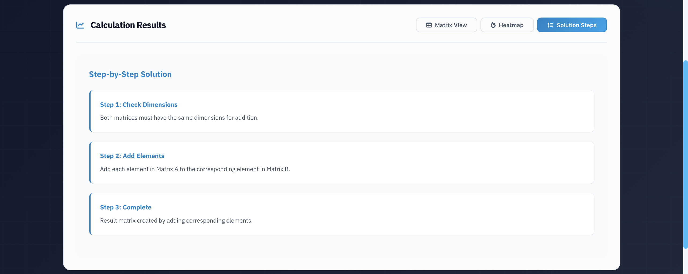

# MatrixLab Pro

MatrixLab Pro is a web-based professional matrix operations application built using **Flask, HTML, CSS, and JavaScript**.  
It allows users to perform a wide range of matrix computations with clear algorithmic logic, step-by-step explanations, and visual representations.

---

## Features

### 🔹 Basic Matrix Operations
- Matrix Addition
- Matrix Subtraction
- Matrix Multiplication
- Matrix Transpose

### 🔹 Scalar & Property Operations
- Scalar Multiplication
- Identity Matrix Generation
- Zero Matrix Generation
- Matrix Equality Check

### 🔹 Linear Algebra Operations
- Determinant (2×2, 3×3)
- Inverse of 2×2 Matrix
- Rank of a Matrix
- Trace of a Matrix
- Adjoint of 2×2 Matrix

### 🔹 Matrix Decompositions
- LU Decomposition
- Cholesky Decomposition
- Eigenvalues (2×2 matrices)

### 🔹 Statistical Operations
- Covariance
- Correlation

### 🔹 Additional Features
- Step-by-step solution explanations
- Heatmap visualization of matrix results
- Calculation history tracking
- Professional and interactive UI

---

## Technologies Used

- **Frontend**: HTML, CSS, JavaScript
- **Backend**: Python, Flask    
- **Visualization**: Chart.js  
- **Environment**: Python Virtual Environment (venv)

---

## Project Structure

matrixlab-pro/ <br>
│ <br>
|─── app.py <br>
│ <br>
|─── utils/ <br>
│ ├── basic_ops.py <br>
│ ├── scalar_ops.py <br>
│ ├── algebra_ops.py <br>
│ ├── advanced_ops.py <br>
│ ├── stats_ops.py <br>
│ └── utilities_ops.py <br>
│ <br>
|─── templates/ <br>
│ └── index.html <br>
│ <br>
|─── static/ <br>
│ ├── style.css <br>
│ └── script.js <br>
│ <br>
|─── README.md <br>
|─── .gitignore <br>

---

## Applications

- Learning and teaching Linear Algebra
- Academic lab demonstrations
- Algorithm visualization
- Engineering and scientific computations
- Data science preprocessing and analysis

---

## Advantages

- Modular and clean backend architecture
- No dependency on black-box math libraries (e.g., NumPy)
- Step-by-step explanations for educational clarity
- Interactive and professional user interface
- Robust error handling and input validation

---

## Future Enhancements

- Support for higher-dimensional matrices
- Additional matrix decompositions (QR, SVD)
- Matrix plotting and graph-based visualizations
- User authentication and saved sessions
- Deployment as a cloud-based service

---

## How to Run the Project

```bash
### 1️. Clone the repository
git clone <repository-url>
cd matrix-operations-web-application

### 2️. Create and activate virtual environment
python -m venv venv
source venv/bin/activate   # On Windows: venv\Scripts\activate

### 3️. Install dependencies
pip install flask

### 4️. Run the application
python3 app.py

### 5️. Open in browser
```
---

## Screenshots

### 🔹 Home Page
Displays the professional UI with operation selection and matrix input.



### 🔹 Matrix Input & Configuration
Manual matrix entry with dimension control and random fill options.



### 🔹 Calculation Result
Shows computed matrix results with proper formatting.


### 🔹 Step-by-Step Explanation
Explains intermediate steps for better understanding.



### 🔹 Calculation History
Displays a list of previously performed operations with timestamps, allowing users to track their calculation flow during a session.


---

## Author
Somepalli Durga Prasad <br>
B.Tech – Computer Science Engineering <br>
Amrita Vishwa Vidyapeetham, Chennai
